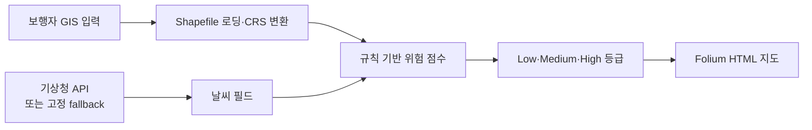

# 고령 보행자 낙상 위험 GIS 지도 프로토타입

[English](README.md)

> [프로젝트 자세히 보기](PORTFOLIO.ko.md)

지형·보행 환경·날씨 입력으로 보행 구간에 휴리스틱 낙상 위험 점수를 매기는 GIS 프로토타입입니다. 검증된 예측 모델이나 임상 낙상 위험 모델이 아니라, 의사결정 지원을 위한 탐색 도구입니다.

## 분석 흐름



## 구현한 방식

- `src/data_loader.py`가 Shapefile을 읽고 표시용 EPSG:4326으로 바꿉니다.
- `src/weather.py`는 `KMA_SERVICE_KEY`가 있으면 기상청 예보를 요청하고, 없으면 데모용 고정 날씨를 사용합니다.
- `src/risk_calculator.py`는 경사·위험요소 수·조도(있을 경우)와 기온·강수·적설·습도·풍속 기준을 적용합니다.
- `src/map_visualizer.py`는 점수가 붙은 구간을 HTML 지도로 그립니다.

가중치는 관찰된 낙상 사고로 보정한 계수가 아니라, 코드에 적은 설계 가정입니다. 예를 들어 경사 7도 초과는 +5점, 비 또는 눈은 +2점입니다.

## 결과 해석

실행 결과는 입력 GIS 구간의 위험 등급과 HTML 지도입니다. 저장소에는 사고 라벨, 실제 경로 결과, 예측 검증 자료가 없으므로 점수가 낙상을 예측하거나 경로가 사고를 줄인다고 말할 수 없습니다.

## 실행

```powershell
pip install -r requirements.txt
python main.py --shapefile "path\to\pedestrian_network.shp"
```

기상청 API를 쓰려면 `KMA_SERVICE_KEY`를 설정합니다. 없으면 고정 fallback 날씨로 결과를 만들며, HTML 지도와 로그를 `results/`에 씁니다.

## 한계와 문서

현재 GIS 입력은 Shapefile sidecar와 출처 메타데이터가 충분하지 않고, 규칙 가중치의 보정 연구·공간 검증·현장 평가도 없습니다. 다음 단계는 완전한 데이터 출처와 사건 라벨을 보관하고, 시간·공간 분리 검증으로 점수를 보정하는 일입니다.

- [포트폴리오 사례 연구](PORTFOLIO.ko.md)
- [프로젝트 리뷰](docs/PROJECT_REVIEW.md)
