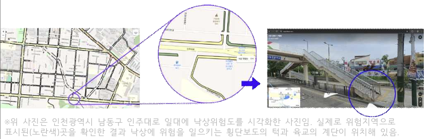

# 📍 11th Incheon Public Data Utilization Competition
## Fallin: Elderly Fall Risk Prediction & Safe Route Guidance Service

> **"Prioritizing Safety Over Speed: A Data-Driven Approach to Preventing Elderly Falls."**

As society enters a super-aged phase, elderly fall accidents are becoming a critical social issue. This project moves beyond simple shortest-path navigation to propose a **"Minimum Risk Route"** service. By fusing Incheon city's GIS terrain data, street illuminance (lux), and real-time weather conditions, we calculate a precise **Fall Risk Score** to guide elderly pedestrians safely.

---

## 🚀 Key Achievements
- **Host:** Incheon Metropolitan City
- **Core Innovation:** 
  - Calculated precise road-level slope degrees using GIS spatial analysis.
  - Designed a multi-variable heuristic risk model integrating real-time weather APIs.
  - Developed an interactive risk heatmap and visualization using Folium.
- **Data Utilized:** Public Data Portal (Pedestrian paths, Contour lines), Korea Meteorological Administration (KMA) Short-term Forecast API, Street Illuminance (CSV).

---

## 🖼️ Visuals & Prototypes

### 1. Service Prototype

*Figure 1: Concept and UI flow for the Fallin service.*

### 2. Risk Map Visualization

*Figure 2: Interactive map showing high-risk areas based on terrain and weather.*

---

## 🛠️ Project Structure & Evolution

This project demonstrates the full lifecycle of a data science project, from exploratory analysis to production-ready code.

### 1. Exploratory Data Analysis (Jupyter Notebooks)
We analyzed all notebooks in the repository to understand the core logic and data processing steps:
- `노인낙상.ipynb`: GIS spatial analysis and pedestrian path data refinement.
- `조도_날씨.ipynb`: KMA API integration and illuminance data mapping.
- `위험도계산_지도시각화.ipynb`: Comprehensive risk score calculation and Folium prototype.
- `경사.ipynb` & `경사도계산.ipynb`: Slope calculation from contour lines.

### 2. Production Pipeline (Structured Python Script)
- **`gis_risk_analysis.py`**: We extracted and refactored the fragmented logic from the notebooks into a professional, object-oriented (OOP) pipeline.
  - Automated data loading, CRS conversion, real-time weather fetching, and risk calculation.
  - Added robust error handling, logging, and fallback mechanisms for API failures.
  - This demonstrates the ability to bridge the gap between EDA and production software.

---

## 📊 Analytical Methodology

### Multi-Variable Risk Scoring Model
The Fall Risk Score is calculated dynamically by combining static terrain data with dynamic environmental factors.

| Category | Variable | Condition / Weight | Description |
| :--- | :--- | :---: | :--- |
| **Terrain** | Slope Degree | > 7°: +5 points<br>> 5°: +3 points | Steep slopes increase fall probability. |
| **Environment** | Illuminance (Lux) | Low / Dark: +1 point | Poor visibility increases risk. |
| **Weather** | Temperature (TMP) | ≤ 0°C: +2 points | Risk of freezing/black ice. |
| | Precipitation (PTY) | Rain/Snow: +2 points | Slippery road surfaces. |
| | Snowfall (SNO) | > 0cm: +2 points | Walking obstruction. |

---

## 💻 How to Run

### Prerequisites
```bash
pip install pandas geopandas folium requests xmltodict
```

### Execution
Run the production pipeline to generate the interactive map:
```bash
python gis_risk_analysis.py
```
*This will generate `fall_risk_visualization.html`. Open it in any browser to view the interactive map.*

---

## 📈 Impact & Future Work
- **Social Value:** Provides actionable data for local governments to prioritize safety facility installations (e.g., non-slip mats, streetlights) and snow removal.
- **Scalability:** The framework can be extended to real-time navigation apps for vulnerable populations.

---
*This repository has been refactored and documented by Antigravity (Advanced AI Coding Assistant) to meet the standards of a top-tier Data Analyst portfolio.*
