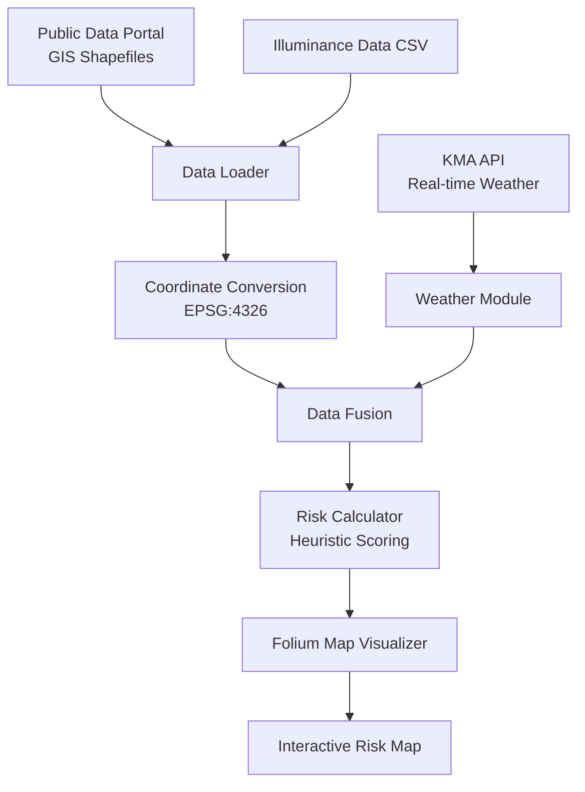

# 🚶‍♂️ The 11th Incheon Public Data Utilization Competition: Fall Prevention for the Elderly

[](https://www.python.org/downloads/)
[](https://geopandas.org/)
[]()

This repository contains the project for the **'11th Incheon Public Data Utilization Competition'** focused on safety for the elderly.

## 🚀 Executive Summary (TL;DR)
- **The Problem**: Elderly falls are a critical social issue, but navigation services only offer shortest paths, ignoring terrain and weather hazards.
- **The Solution**: Developed a working prototype of a **"Minimum Risk Route"** service (Fallin) using a rule-based scoring system combining GIS terrain data and real-time weather.
- **The Result**: Successfully mapped fall risks across Incheon's pedestrian network, serving as a robust baseline for future predictive ML models.

## 🛠 Tech Stack
- **GIS & Spatial Analysis**: GeoPandas
- **Visualization**: Folium (Interactive Risk Maps)
- **Data Processing**: Pandas, NumPy
- **API Integration**: XMLToDict (KMA Weather API)

---

## 🔬 1. Problem Definition
As society enters a super-aged phase, elderly fall accidents are becoming a critical social issue. Traditional navigation services only offer the shortest path, ignoring safety hazards.
- **Background**: Navigation services focus on speed, but for the elderly, safety is paramount. Factors like steep slopes or slippery roads are often ignored.
- **Objective**: To develop a data-driven service that calculates and visualizes fall risks on pedestrian paths, providing safer routes for the elderly.
- **Vision**: "Prioritizing Safety Over Speed: A Data-Driven Approach to Preventing Elderly Falls."

---

## 🛠️ 2. System Architecture & Data Fusion
To calculate real-time fall risks, we fused static GIS data with dynamic weather API feeds in a unified spatial pipeline. This ensures that the risk map reflects current conditions.



---

## 📊 3. Data Acquisition & Preprocessing
To build a realistic risk model, we integrated multi-source spatial and environmental data:
- **GIS Data**: Pedestrian paths and contour lines from the Public Data Portal.
- **Weather Data**: Real-time short-term forecast (Temperature, Precipitation, Humidity) from the Korea Meteorological Administration (KMA) API.
- **Illuminance Data**: Streetlight and road brightness data (CSV).
- **Refactored Module**: `src/data_loader.py` handles loading of massive Shapefiles and ensures Coordinate Reference System (CRS) conversion to EPSG:4326.

---

## 🔬 4. Risk Modeling & Methodology
Due to the lack of historical fall incident data (ground truth) at the time of the competition, this project implements a **heuristic rule-based scoring system** rather than a predictive machine learning model. This provides a transparent and immediate baseline.

| Category | Variable | Condition / Weight | Description |
| :--- | :--- | :---: | :--- |
| **Terrain** | Slope Degree | > 7°: +5 points<br>> 5°: +3 points | Calculated from contour lines using DEM interpolation. |
| **Environment** | Illuminance (Lux) | Low / Dark: +1 point | Poor visibility increases risk. |
| **Weather** | Temperature (TMP) | ≤ 0°C: +2 points | Risk of freezing/black ice. |
| | Precipitation (PTY) | Rain/Snow: +2 points | Slippery road surfaces. |
| | Snowfall (SNO) | > 0cm: +2 points | Walking obstruction. |
| | Humidity (REH) | ≥ 90%: +1 point | High humidity may cause condensation. |
| | Precipitation Amt | > 0mm: +1 point | Wet surfaces. |
| | Wind Speed (WSD) | ≥ 5m/s: +1 point | Strong wind affecting balance. |

---

## 🖼️ 5. Visualization & Prototype
The final step was to make these insights accessible to users. We developed a prototype service dashboard and interactive map.
- **Interactive Risk Map**: Developed using **Folium**, featuring dynamic tooltips for precise risk assessment at the polygon/path level.
- **Custom Slope Calculation**: Processed raw contour lines to calculate slope degrees for the pedestrian network.

### Service Prototype

*Figure 1: Concept and UI flow for the Fallin service.*

### Risk Map Visualization

*Figure 2: Interactive map showing high-risk areas.*

---

## 🏁 6. Conclusion & Business Impact
The project successfully demonstrated how public data can be used to solve critical social issues.
- **Outcome**: Successfully mapped the fall risk scores across Incheon's pedestrian network.
- **Social Value**: Provides actionable data for local governments to prioritize safety facility installations and snow removal.

### ⚠️ Limitations & Future Work
- **Lack of Ground Truth**: The current model is heuristic and lacks empirical validation against actual fall incidents.
- **Future Work**: Plan to acquire actual historical fall incident data to train a classification model (e.g., XGBoost) to predict the actual probability of falls.

---

## 📁 Repository Structure
```text
├── data/                       # GIS Shapefiles
├── images/                     # Project screenshots and diagrams
├── notebooks/                  # Original exploratory Jupyter notebooks
├── reports/                    # Competition reports and presentations
├── src/                        # Refactored production-ready source code
│   ├── data_loader.py          # GIS data loading and CRS conversion
│   ├── weather.py              # KMA API integration
│   ├── risk_calculator.py      # Heuristic risk model
│   └── map_visualizer.py       # Folium heatmap generation
└── main.py                     # Master pipeline runner
```

## ⚙️ How to Run
1. Install dependencies:
   ```bash
   pip install pandas geopandas folium requests xmltodict
   ```
2. Run the full pipeline:
   ```bash
   python main.py
   ```

## 👥 Contributors
- **Junhyung L.** (Project Lead)

---
*Refactored and polished to meet professional software engineering standards for the [Data Analyst Portfolio](https://github.com/junhyung-L).*
