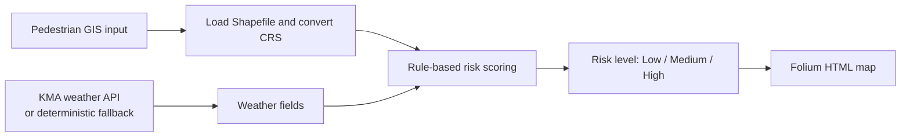

# Heuristic GIS Fall-Risk Mapping for Older Pedestrians

[한국어](README.ko.md)

> [Project details](PORTFOLIO.md)

This repository implements a GIS-based prototype that assigns heuristic
fall-risk scores to pedestrian segments from terrain, environment, and weather
inputs. It is a decision-support exploration, not a validated predictive or
clinical fall-risk model.

## Analysis flow



## Implemented approach

- `src/data_loader.py` loads the supplied Shapefile and converts its CRS to
  EPSG:4326 for display.
- `src/weather.py` requests KMA weather when `KMA_SERVICE_KEY` is configured;
  otherwise it returns a deterministic fallback scenario for demonstration.
- `src/risk_calculator.py` applies explicit thresholds for slope, risk count,
  illuminance when available, and weather fields including temperature,
  precipitation, snowfall, humidity, and wind speed.
- `src/map_visualizer.py` renders the scored segments to an HTML map.

The weights are hard-coded design assumptions, not coefficients calibrated on
observed fall incidents. For example, slopes above 7 degrees add five points;
rain or snow adds two points.

## Result boundary

The workflow generates an HTML map and risk levels for the supplied GIS input.
The repository retains no incident labels, ground-truth route outcomes, or
predictive-validation results. It therefore does not establish that a score
predicts falls or that a route reduces fall risk.

## Run

Install the listed dependencies, then supply a complete Shapefile dataset:

```powershell
pip install -r requirements.txt
python main.py --shapefile "path\\to\\pedestrian_network.shp"
```

Set `KMA_SERVICE_KEY` to use the KMA API. Without it, the output uses the
deterministic fallback weather scenario. The command writes an HTML map and a
run log under `results/`.

## Limitations

- The retained GIS inputs do not include enough Shapefile sidecar files or
  source metadata to establish dataset coverage and segment counts.
- Rule weights have no retained calibration study or citations in this
  repository.
- No incident labels, spatial validation, field evaluation, or policy outcome
  evaluation is implemented.
- Live-service behaviour is not validated; the API fallback is for
  demonstration only.

## Documentation

- [Portfolio case study](PORTFOLIO.md)
- [Project review](docs/PROJECT_REVIEW.md)
